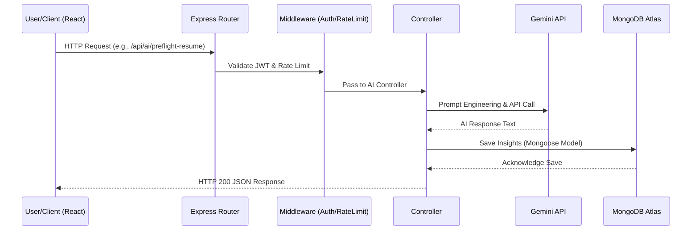

<div align="center">
  

  <h1>🚀 Smart Internship & Career Tracker</h1>
  <p>
    <em>The Ultimate Placement Operating System for Students and Job Seekers.</em>
  </p>

  <!-- Badges -->
  <p>
    
    
    
  </p>
  <p>
    
    
    
    
  </p>
</div>

<hr />

## 📖 Table of Contents
- [Overview](#overview)
- [Problem Statement](#problem-statement)
- [Solution](#solution)
- [Features](#features)
- [Screenshots](#screenshots)
- [Demo](#demo)
- [Architecture](#architecture)
- [Technology Stack](#technology-stack)
- [Folder Structure](#folder-structure)
- [Installation](#installation)
- [Configuration](#configuration)
- [Environment Variables](#environment-variables)
- [API Documentation](#api-documentation)
- [Database](#database)
- [Authentication & Authorization](#authentication--authorization)
- [Security](#security)
- [AI Components](#ai-components)
- [Workflow](#workflow)
- [Error Handling & Logging](#error-handling--logging)
- [Monitoring & Performance](#monitoring--performance)
- [Testing](#testing)
- [Deployment](#deployment)
- [Scripts](#scripts)
- [Contributing & Coding Standards](#contributing--coding-standards)
- [Git Workflow](#git-workflow)
- [Changelog & Roadmap](#changelog--roadmap)
- [Troubleshooting & FAQ](#troubleshooting--faq)
- [Credits, License & Contact](#credits-license--contact)
- [Appendix](#appendix)

---

## 🌍 Overview
The **Smart Internship & Career Tracker** is a comprehensive, full-stack monorepo application designed to centralize the placement lifecycle. By integrating AI-driven resume parsing, automated application tracking, DSA progression analytics, and real-time networking CRM, it transforms the chaotic job-hunt process into a highly structured, data-driven pipeline.

## 🎯 Problem Statement
The modern job hunt is deeply fragmented. Students juggle Excel sheets for application tracking, Google Calendars for interviews, disparate platforms for resume building, and generic templates for cold outreach. This context-switching leads to missed deadlines, unoptimized resumes, poor interview preparation, and severe burnout.

## 💡 Solution
This project provides a unified "Placement Operating System". It centralizes the entire hiring pipeline into a single glassmorphism-styled dashboard. Users can build ATS-compliant resumes, log coding practice, schedule interviews, receive Twilio-powered WhatsApp nudges, and leverage Google Gemini for AI-driven insights, ensuring a streamlined path to a dream career.

---

## ✨ Features

### Core Features
- **Unified Pipeline Tracking:** Kanban-style and list-based application manager (OA, Interview, Selected, Rejected).
- **Interactive Calendar:** Visual timeline of applications and upcoming interviews.
- **Offer & Compensation Analytics:** Log, calculate, and compare total CTC breakdowns (Base, Sign-On, Equity).
- **Networking CRM:** Track cold outreach efforts across LinkedIn/Email and save templates.

### Advanced Features
- **DSA & Coding Hub:** Log Data Structures & Algorithms practice (LeetCode, Codeforces) and track difficulty distribution.
- **Goal Setting Engine:** Gamified weekly targets for applications, DSA practice, and networking.

### AI Features
- **ATS Resume Builder:** Dynamically build resumes and run an AI Pre-flight check (via Google Gemini) for ATS optimization.
- **Interview Preparation:** AI-driven mock questions and behavioral story analysis.

### Security Features
- **JWT-Based Authentication:** Secure, stateless user sessions.
- **Global Rate Limiting:** Built-in Express rate limiting to prevent brute-force attacks.

### Performance Features
- **Vite Build System:** Lightning-fast HMR and optimized production bundles.
- **Client-Side Caching:** Efficient state management utilizing context and local storage where applicable.

### Future Features
- Full Dockerization and Kubernetes orchestration.
- Expanded End-to-End (E2E) testing suite.
- Advanced RAG (Retrieval-Augmented Generation) for hyper-personalized interview prep.

---

## 🖼️ Screenshots

*Screenshots are currently in development. Replace placeholders once UI is finalized.*

- `[PLACEHOLDER: Dashboard View]`
- `[PLACEHOLDER: Kanban Board]`
- `[PLACEHOLDER: AI ATS Checker]`
- `[PLACEHOLDER: DSA Progress Charts]`

---

## 🎥 Demo

*Demo URL or Video Link will be placed here.*
`[DEMO_URL_PLACEHOLDER]`

---

## 🏗️ Architecture

The application is structured as a decoupled client-server architecture inside a monorepo.

### Frontend
A single-page application (SPA) built with React 18 and Vite. It utilizes TailwindCSS for utility-first styling and Framer Motion for micro-animations. State is managed via React hooks (Context, Reducers, Zustand) and data fetching happens asynchronously via Axios.

### Backend
A Node.js/Express.js RESTful API serving as the central nervous system. It strictly adheres to the MVC (Model-View-Controller) design pattern.

### Database
MongoDB Atlas (NoSQL) managed via Mongoose ODM. The database is heavily normalized across 151 distinct schemas to handle the vast complexity of the placement domain.

### Infrastructure & Deployments
- **Frontend:** Deployed statically via Vercel (or similar CDN).
- **Backend:** Deployed as a web service on Render (or similar PaaS).

### AI Services
Google Gemini SDK (`@google/genai`) is deeply integrated into the backend controllers to process resumes, evaluate interview answers, and generate text.

### Third-Party Integrations
- **Twilio:** For real-time WhatsApp notifications.
- **Resend:** For transactional email delivery.

### Request Flow


---

## 💻 Technology Stack

### Frontend
- **React 18 & Vite:** For blazing fast development and optimized production builds.
- **TailwindCSS & Framer Motion:** For highly responsive, animated, glassmorphism UIs.
- **Recharts:** For rendering complex data analytics (DSA progress, CTC comparisons).
- **React-Router-DOM:** For client-side routing.
- **React-PDF:** For dynamic resume PDF generation.

### Backend
- **Node.js & Express.js:** Lightweight, non-blocking asynchronous event-driven backend.
- **Mongoose:** For rigid schema enforcement on NoSQL data.
- **JSON Web Tokens (JWT):** For stateless, scalable authentication.

### Database
- **MongoDB Atlas:** Highly scalable cloud NoSQL database perfectly suited for complex, nested JSON data representing resumes and interview structures.

### Cloud & DevOps
- **Vercel / Render:** Zero-config PaaS deployment pipelines.

### AI & Integrations
- **Google Gemini API:** Chosen for its massive context window and fast inference for text generation.
- **Twilio & Resend:** For multi-channel user notifications.

---

## 📁 Folder Structure

```text
StudentTracker/
├── client/                 # Frontend React Application
│   ├── public/             # Static assets
│   ├── src/
│   │   ├── components/     # Reusable UI widgets
│   │   ├── pages/          # Full page views
│   │   ├── utils/          # Helpers (Axios instances, formatters)
│   │   └── App.jsx         # Root router
│   ├── package.json        # Frontend dependencies
│   ├── vercel.json         # Vercel deployment configuration
│   └── vite.config.js      # Vite build pipeline
│
└── server/                 # Backend Node/Express API
    ├── config/             # Database connection setups
    ├── controllers/        # Business logic for all routes
    ├── cron/               # Scheduled background tasks (Node-cron)
    ├── models/             # 151 Mongoose database schemas
    ├── routes/             # 37 Express API route definitions
    ├── services/           # Reusable backend services
    ├── utils/              # Backend helpers
    ├── package.json        # Backend dependencies
    └── server.js           # Express application entry point
```

---

## ⚙️ Installation

### Prerequisites
- Node.js (v18+ recommended)
- MongoDB Atlas cluster URL (or local instance)
- API Keys (Google Gemini, Twilio, Resend)

### Local Setup

1. **Clone the repository:**
   ```bash
   git clone [REPO_URL_PLACEHOLDER]
   cd StudentTracker
   ```

2. **Backend Setup:**
   ```bash
   cd server
   npm install
   ```

3. **Frontend Setup:**
   ```bash
   cd ../client
   npm install
   ```

### Run Locally

Start the backend (Terminal 1):
```bash
cd server
npm run dev
```

Start the frontend (Terminal 2):
```bash
cd client
npm run dev
```
Navigate to `http://localhost:5173`.

### Docker Setup
*(Currently, Dockerization is planned for the future roadmap. Native NPM scripts are the primary execution method).*

---

## 🔑 Environment Variables

### Frontend (`client/.env`)
| Variable | Purpose | Required | Example |
| :--- | :--- | :--- | :--- |
| `VITE_API_URL` | Points to backend API | Yes | `http://localhost:5000/api` |
| `VITE_GOOGLE_CLIENT_ID` | OAuth Integration | No | `109772...googleusercontent.com` |

### Backend (`server/.env`)
| Variable | Purpose | Required | Example |
| :--- | :--- | :--- | :--- |
| `PORT` | Express listening port | No | `5000` |
| `MONGODB_URI` | Database connection string | Yes | `mongodb+srv://...` |
| `JWT_SECRET` | Token signing secret | Yes | `supersecretkey` |
| `GEMINI_API_KEY` | Google AI Studio Key | Yes | `AIzaSy...` |
| `TWILIO_ACCOUNT_SID` | WhatsApp messaging | No | `AC...` |
| `RESEND_API_KEY` | Email dispatching | No | `re_...` |

---

## 📡 API Documentation

*The backend utilizes 37 distinct route files. Below is a high-level representation of core domains.*

### Core Endpoints

- **Auth:** `POST /api/auth/register`, `POST /api/auth/login`
  - *Desc:* Handles user registration and issues JWTs.
- **Applications:** `GET /api/applications`, `POST /api/applications`
  - *Desc:* CRUD operations for job applications.
- **AI Engine:** `POST /api/ai/preflight-resume`
  - *Desc:* Submits resume text to Gemini for ATS scoring.
- **DSA Tracking:** `GET /api/dsa`, `POST /api/dsa`
  - *Desc:* Logs competitive programming metrics.

### Authentication
Most routes are protected by a `protect` middleware which verifies the Bearer token passed in the `Authorization` header.

### Errors
Returns standard HTTP status codes (400, 401, 403, 404, 500) with a JSON payload:
```json
{
  "message": "Error description here",
  "stack": "Stack trace (Development only)"
}
```

---

## 🗄️ Database
Built on MongoDB via Mongoose. The database architecture is incredibly robust, featuring **151 distinct schemas**.

### Key Collections:
- **User:** Manages authentication, profile, and global settings.
- **Application:** Stores job role, company, status, and timeline arrays.
- **Resume:** Stores customized text, PDF links, and AI-generated ATS scores.
- **DSA:** Logs problems, patterns, and weakness areas.
- **Interview:** Logs scheduled events, mock feedback, and interviewer psychology profiles.

*Migrations are currently handled implicitly via Mongoose schema definitions and defaults.*

---

## 🛡️ Authentication & Authorization
- **Authentication:** Managed via JSON Web Tokens (JWT). Passwords are cryptographically hashed using `bcryptjs` before insertion into the database.
- **Authorization:** Handled via custom middleware. Users can only access and modify documents linked to their `user._id`.

---

## 🔒 Security
- **Rate Limiting:** Global `express-rate-limit` implemented in `server.js` (Max 200 req / 15 mins in production) to prevent DDoS and brute-force attacks.
- **Secret Management:** Strict `.env` isolation. 
- **CORS:** Configured in Express to allow authorized domain cross-origin requests.
- **Password Encryption:** Salted and hashed via `bcryptjs`.

---

## 🧠 AI Components
Deeply integrated with **Google Gemini (`@google/genai`)**.

- **Models:** Uses Gemini Pro variations for text synthesis.
- **Prompt Flow:** The `aiController` constructs highly specific, zero-shot and few-shot prompts using user context (e.g., job descriptions, current resume bullets) to force structured JSON responses from the LLM.
- **Usage:**
  - ATS Resume Parsing & Improvement suggestions.
  - Mock Interview Answer Evaluation.
  - Cold Email Template Generation.

---

## 🔄 Workflow
1. User logs in (JWT issued and stored in client context).
2. User builds a resume in the Resume Builder.
3. User triggers the AI Pre-flight checker. The client hits `/api/ai/preflight-resume`.
4. Backend parses the request, prompts Gemini, and returns actionable feedback.
5. User applies for a job, logs it in the Kanban board (`/api/applications`).
6. Node-cron runs a nightly job checking for upcoming interviews and triggers a Twilio WhatsApp nudge to the user.

---

## 🐛 Error Handling & Logging
- **Global Error Middleware:** Captures synchronous and asynchronous Express errors, formatting them cleanly and stripping stack traces in `production`.
- **Logging:** Basic `console.log` interceptors exist for request monitoring. *(Advanced Winston/Morgan logging is a future roadmap item).*

---

## 📈 Monitoring & Performance
- **Client Optimization:** Built with Vite for rapid HMR and automated chunk splitting in production. React state minimizes unnecessary re-renders.
- **Backend Optimization:** Async/Await throughout to prevent event-loop blocking. Connection pooling utilized inherently by MongoDB Node driver.

---

## 🧪 Testing
*(Automated Testing Suite is currently in development. Unit tests (Jest) and E2E (Cypress) will be introduced in upcoming iterations).*
Currently, testing is conducted manually via Postman for the API and browser testing for the client.

---

## 🚀 Deployment
### Frontend (Vercel)
1. Link the repository to Vercel.
2. Set Root Directory to `client`.
3. Set Framework Preset to `Vite`.
4. Inject Environment Variables.
5. Deploy.

### Backend (Render)
1. Link repository as a Web Service.
2. Set Root Directory to `server`.
3. Build Command: `npm install`
4. Start Command: `npm start`
5. Inject Environment Variables.
6. Deploy.

---

## 📜 Scripts

### Backend (`server/package.json`)
- `npm start`: Runs the production server (`node server.js`).
- `npm run dev`: Runs the development server (currently mapped to `node server.js`, can be swapped to `nodemon`).

### Frontend (`client/package.json`)
- `npm run dev`: Starts the Vite development server.
- `npm run build`: Compiles and minifies the React application to the `/dist` folder.
- `npm run preview`: Locally serves the production build.
- `npm run lint`: Executes ESLint rules.

---

## 🤝 Contributing & Coding Standards
1. Fork the Project
2. Create your Feature Branch (`git checkout -b feature/AmazingFeature`)
3. Follow ESLint guidelines provided in the frontend folder.
4. Keep Mongoose schemas modular.
5. Commit your Changes (`git commit -m 'feat: Add some AmazingFeature'`)
6. Push to the Branch (`git push origin feature/AmazingFeature`)
7. Open a Pull Request

---

## 🌳 Git Workflow
The project follows a standard Feature Branch workflow. Main is protected, and all development occurs on `feature/*` or `fix/*` branches.

---

## 🛣️ Changelog & Roadmap
- **MVP 1:** Basic Application Tracking and Authentication.
- **MVP 2 (Current):** AI Resume Builder, Glassmorphism UI, Twilio Nudges.
- **Roadmap:** Dockerization, Automated Testing Suite, OAuth Login enhancements, RAG Interview Prep.

---

## ⚠️ Known Limitations
- Vercel client-side routing requires a `vercel.json` rewrite rule to prevent 404s on hard refresh.
- AI processing times depend heavily on Google Gemini API latency.

---

## 🔧 Troubleshooting & FAQ

**Q: I'm getting a 404 on Vercel when refreshing the page.**
A: Ensure your Vercel Project settings have the Root Directory set to `client`. The existing `vercel.json` will automatically handle SPA rewrites.

**Q: My backend deployed on Render fails with `MODULE_NOT_FOUND`.**
A: Linux (Render) is case-sensitive. Ensure your `require()` statements perfectly match the file names in the repository.

**Q: AI features are failing.**
A: Verify that `GEMINI_API_KEY` is correctly set in your backend environment variables and that your Google Cloud account has billing enabled or quota remaining.

---

## 👏 Credits, License & Contact

**Author:** `[AUTHOR_NAME_PLACEHOLDER]`
**Contact:** `[CONTACT_EMAIL_PLACEHOLDER]`
**License:** Distributed under the `[LICENSE_PLACEHOLDER]` License.

---

## 📚 Appendix

**Useful Commands:**
- Flush Node modules: `rm -rf node_modules package-lock.json && npm install`
- Check Node Version: `node -v` (v18+ Required)

**Design Tradeoffs:**
- Chose NoSQL (MongoDB) over SQL to allow highly flexible, evolving schema designs for AI-generated text objects and dynamic interview questions.
- Monorepo structure chosen for development simplicity over separated micro-repositories.
