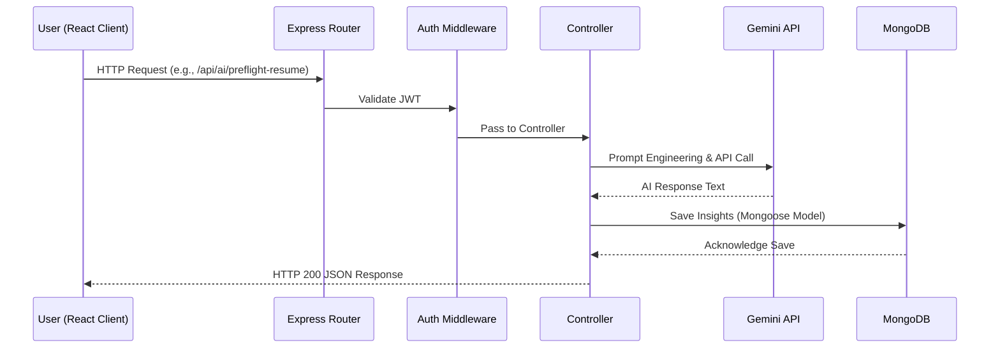

<div align="center">
  
  <h1>🚀 Smart Internship & Career Tracker</h1>
  <p><em>The Ultimate Placement Operating System for Students and Job Seekers.</em></p>
</div>

<hr />

## 2. Executive Summary
The Smart Internship & Career Tracker is a comprehensive, full-stack monorepo application designed to centralize the entire placement lifecycle. It integrates AI-driven resume parsing, automated job application tracking, Data Structures & Algorithms (DSA) progression analytics, and a real-time networking CRM, effectively transforming the chaotic job-hunt process into a highly structured, data-driven pipeline.

## 3. Problem Statement
The modern job hunt is deeply fragmented. Students are forced to juggle Excel sheets for application tracking, Google Calendars for interviews, disparate web platforms for resume building, and generic text files for cold outreach templates. This extreme context-switching leads to missed deadlines, unoptimized resumes, poor interview preparation, and severe candidate burnout.

## 4. Solution Overview
This project provides a unified "Placement Operating System". It centralizes the entire hiring pipeline into a single dashboard. Users can build ATS-compliant resumes, log their coding practice, schedule interviews, receive WhatsApp nudges via Twilio, and leverage Google Gemini for AI-driven insights, ensuring a highly streamlined path to securing a role.

## 5. Key Features

**Core Features**
- **Unified Pipeline Tracking:** Kanban-style and list-based application manager (Applied, OA, Interview, Selected, Rejected).
- **Offer Analytics:** Log, calculate, and visually compare total CTC breakdowns (Base, Sign-On, Equity).
- **Networking CRM:** Track cold outreach efforts across LinkedIn/Email and save templates.
- **Goal Setting Engine:** Gamified weekly targets for applications, DSA practice, and networking.

**AI Features**
- **ATS Resume Builder:** Dynamically build resumes and run an AI Pre-flight check (via Google Gemini) for ATS optimization.
- **Mock Interviews:** Evaluates user answers and provides behavioral feedback.

**Developer Features**
- **Massive Schema Architecture:** Utilizes 151 highly specialized Mongoose schemas to represent complex hiring domains.

**Security Features**
- **Stateless JWT Auth:** Token-based authentication flow.
- **Global Rate Limiting:** Brute-force protection on the Express server.

## 6. Architecture Overview

The application is structured as a decoupled client-server architecture inside a monorepo.

- **Frontend:** A React 18 SPA built with Vite. Communicates with the backend via REST HTTP requests using Axios.
- **Backend:** A Node.js/Express.js RESTful API serving as the central logic layer.
- **Database:** MongoDB Atlas (NoSQL) managed via Mongoose.
- **AI Services:** Google Gemini SDK (`@google/genai`) integrates directly into backend controllers.
- **Background Jobs:** Handled via `node-cron` for scheduling notifications.

### Request Flow


## 7. Technology Stack

- **Frontend:** React 18, Vite, TailwindCSS, Framer Motion, Recharts. Chosen for blazing fast HMR, utility-first styling, and robust data visualization capabilities.
- **Backend:** Node.js, Express.js. Chosen for lightweight, asynchronous, non-blocking I/O capable of handling high concurrent requests.
- **Database:** MongoDB Atlas, Mongoose. Chosen for highly flexible, document-based NoSQL storage necessary to represent constantly evolving, deeply nested hiring structures (like resumes and interview logs).
- **AI Engine:** Google Gemini API. Chosen for fast text-generation inference and large context windows for processing resumes.
- **External Services:** Twilio (WhatsApp Messaging), Resend (Transactional Emails).

## 8. Folder Structure

```text
StudentTracker/
├── client/                 # Frontend React Application
│   ├── public/             # Static assets (including Vite SVGs)
│   ├── src/
│   │   ├── components/     # Reusable UI widgets
│   │   ├── pages/          # Full page views (Dashboard, ResumeBuilder)
│   │   ├── utils/          # Helpers (Axios instances, formatters)
│   │   └── App.jsx         # Root router
│   ├── package.json        # Frontend dependencies
│   ├── vercel.json         # Vercel deployment configuration (handles SPA rewrites)
│   └── vite.config.js      # Vite build pipeline
│
└── server/                 # Backend Node/Express API
    ├── config/             # DB connection logic
    ├── controllers/        # Business logic for routes
    ├── cron/               # Scheduled background tasks (Node-cron)
    ├── models/             # 151 Mongoose database schemas
    ├── routes/             # 37 Express API route definitions
    ├── services/           # Reusable backend services
    ├── utils/              # Backend helpers
    ├── package.json        # Backend dependencies
    └── server.js           # Express application entry point
```

## 9. Installation

### Prerequisites
- Node.js (v18+)
- MongoDB Atlas cluster URL (or local instance)

### Local Setup
1. **Clone the repository:**
   ```bash
   git clone [REPOSITORY_URL_PLACEHOLDER]
   cd my-personal-tracking-system-
   ```
2. **Backend Setup:**
   ```bash
   cd server
   npm install
   ```
3. **Frontend Setup:**
   ```bash
   cd ../client
   npm install
   ```

### Running Locally
Open two terminal windows.
Terminal 1 (Backend):
```bash
cd server
npm run dev
```
Terminal 2 (Frontend):
```bash
cd client
npm run dev
```

*Note: No Docker setup (`Dockerfile` or `docker-compose.yml`) is currently present in the repository.*

## 10. Configuration
- `client/vite.config.js`: Configures the Vite build process. Note that `maximumFileSizeToCacheInBytes` has been increased to `10485760` to accommodate large PDF-rendering libraries during the PWA build step.
- `client/vercel.json`: Handles Vercel SPA routing by rewriting `/(.*)` to `/index.html`, preventing 404s on hard refreshes.

## 11. Environment Variables

### Frontend (`client/.env`)
| Variable | Purpose | Required | Example |
| :--- | :--- | :--- | :--- |
| `VITE_API_URL` | Points to backend API | Yes | `http://localhost:5000/api` |
| `VITE_GOOGLE_CLIENT_ID` | OAuth Integration | No | `109772...` |
| `VITE_GITHUB_CLIENT_ID` | OAuth Integration | No | `Ov23...` |
| `VITE_LINKEDIN_CLIENT_ID` | OAuth Integration | No | `777sk8...` |

### Backend (`server/.env`)
| Variable | Purpose | Required | Example |
| :--- | :--- | :--- | :--- |
| `PORT` | Express port | No | `5000` |
| `MONGODB_URI` | Database connection | Yes | `mongodb+srv://...` |
| `JWT_SECRET` | Token signing secret | Yes | `supersecretkey` |
| `NODE_ENV` | Environment context | Yes | `production` |
| `GEMINI_API_KEY` | Google AI Studio Key | Yes | `AIzaSy...` |
| `TWILIO_ACCOUNT_SID` | WhatsApp API SID | No | `AC...` |
| `TWILIO_AUTH_TOKEN` | WhatsApp API Token | No | `dbb...` |
| `RESEND_API_KEY` | Email API Key | No | `re_...` |
| `CLIENT_URL` | Frontend URL for CORS | Yes | `https://your-frontend.vercel.app` |

## 12. API Documentation

*The backend utilizes 37 distinct route files. Below is a high-level representation of core domains.*

- **Auth** (`/api/auth`)
  - `POST /register`, `POST /login`: Handles JWT issuance.
  - `POST /check-whatsapp`: Verifies Twilio phone number activation status.
- **AI Engine** (`/api/ai`)
  - `POST /preflight-resume`: Submits resume text to Gemini for ATS scoring. (Requires Auth).
- **Applications** (`/api/applications`)
  - `GET /`, `POST /`: CRUD operations for job applications.
- **DSA** (`/api/dsa`)
  - `GET /`, `POST /`: Operations for logging DSA competitive programming metrics.

## 13. Database Design
Built on MongoDB via Mongoose. The database architecture is incredibly robust, featuring **151 distinct schemas** to model extreme domain complexity.

- **User:** Authentication and global settings.
- **Application:** Stores job role, company, status, and timeline arrays.
- **Resume:** Stores customized text, PDF links, and AI-generated ATS scores.
- **DSA:** Logs problems, patterns, and weakness areas.
- **Interview:** Logs scheduled events, mock feedback, and interviewer psychology profiles.

*Note: Migrations are handled implicitly via Mongoose schema defaults rather than explicit migration scripts.*

## 14. Authentication and Security
- **Auth Flow:** Standard stateless JWT flow. Passwords hashed via `bcryptjs`. Tokens are sent in the `Authorization: Bearer <token>` header.
- **Authorization:** Managed via a `protect` middleware which decodes the JWT and validates user existence.
- **Rate Limiting:** `express-rate-limit` is applied globally in `server.js` (Max 200 req / 15 mins in production).
- **CORS:** Configured in Express to allow authorized domain cross-origin requests.

## 15. AI Components
Deeply integrated with **Google Gemini** (`@google/genai`).
- **Models:** Gemini Pro variations utilized for text synthesis.
- **Prompts:** Hardcoded zero-shot and few-shot prompts exist in `aiController.js` which inject user data (Resume JSON, Job Descriptions) to force structured outputs from the LLM.
- **Context & Memory:** Currently stateless per request. No vector database or RAG implementation is currently present in the codebase.

## 16. Testing
- **Status:** **Testing is currently incomplete/missing.**
- There are no robust Jest, Mocha, or Cypress configurations visible in the repository. Testing is presumed manual at this stage.

## 17. Deployment
- **Frontend:** Optimized for Vercel. Must set Root Directory to `client` and Framework Preset to `Vite`.
- **Backend:** Optimized for Render as a Web Service. Must set Root Directory to `server` and use `npm start`.

## 18. Scripts
**Frontend (`client/package.json`)**
- `npm run dev`: Starts Vite dev server.
- `npm run build`: Compiles for production.
- `npm run lint`: Executes ESLint.

**Backend (`server/package.json`)**
- `npm start`: Runs `node server.js` for production.
- `npm run dev`: Runs `node server.js` for development.

## 19. Troubleshooting
- **Vercel 404 Errors:** Ensure the Root Directory is set to `client` so Vercel builds the React app instead of serving the repository root.
- **Render Deployment Crash (`MODULE_NOT_FOUND`):** Ensure file casing in `require()` strictly matches the file system (Linux is case-sensitive, unlike Windows). E.g., `prepHubRoutes.js` vs `prephubRoutes.js`.

## 20. Roadmap
- Expand AI capabilities for hyper-personalized interview prep.
- Introduce automated testing suites (Jest/Cypress).
- Dockerize backend and frontend for universal orchestration.

## 21. Contribution Guide
1. Fork the Project.
2. Create your Feature Branch (`git checkout -b feature/AmazingFeature`).
3. Ensure no linting errors (`npm run lint`).
4. Commit your Changes (`git commit -m 'feat: Add some AmazingFeature'`).
5. Push to the Branch (`git push origin feature/AmazingFeature`).
6. Open a Pull Request.

## 22. Information Needed
*The following information cannot be determined from the repository and requires maintainer input to finalize the documentation:*
- **Project Name & Branding:** What is the official name of the project (StudentTracker vs. Smart Internship & Career Tracker)?
- **License:** What open-source license should be applied?
- **Credits & Contact:** Who is the official author and what is the contact email for the repository?
- **Live URLs:** What are the official production Vercel/Render URLs for the demo section?
- **Testing Strategy:** Are there plans to adopt a specific testing framework in the immediate future?
