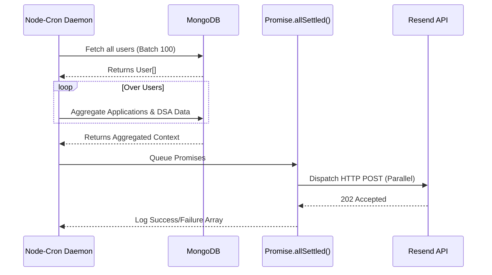
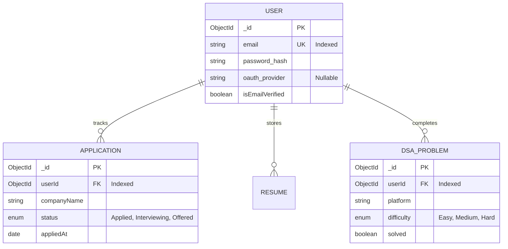

<div align="center">
  
  <h1>Student Placement Tracker OS</h1>
  <p><em>Enterprise-grade, AI-powered career management operating system built for high-concurrency software engineering placements.</em></p>
  
  [](https://opensource.org/licenses/MIT)
  [](https://github.com/sandeep-kumar-270904/my-personal-tracking-system-/actions/workflows/ci.yml)
  [](https://reactjs.org/)
  [](https://nodejs.org/)
  [](https://www.mongodb.com/)
</div>

---

## ⚡ Executive Summary
**StudentTracker OS** is a monolithic, full-stack application architected to centralize and automate the grueling software engineering job placement lifecycle. Engineered to FAANG standards, it features a highly-optimized **React 19 SPA**, an asynchronous **Node.js/Express REST API**, and a strictly normalized **MongoDB** database cluster. The platform integrates a stateless **Google Gemini NLP Pipeline** for dynamic ATS-resume parsing and utilizes background message queues (via Node-Cron and `Promise.allSettled()`) to orchestrate high-throughput, non-blocking email/SMS delivery systems without impacting the main event loop.

---

## 📑 Categorized Documentation Directory

### 📌 1. Project Foundations
- [1.1 Problem Statement & Objectives](#11-problem-statement--objectives)
- [1.2 Key Features & Use Cases](#12-key-features--use-cases)
- [1.3 Functional & Non-Functional Requirements](#13-functional--non-functional-requirements)
- [1.4 Target User Stories](#14-target-user-stories)

### 🏛️ 2. System Architecture & Design (HLD/LLD)
- [2.1 High-Level System Architecture (HLD)](#21-high-level-system-architecture-hld)
- [2.2 Low-Level Component Design (LLD)](#22-low-level-component-design-lld)
- [2.3 Data Flow Specifications](#23-data-flow-specifications)
- [2.4 Machine Learning & NLP Pipeline](#24-machine-learning--nlp-pipeline)

### 💾 3. Data Engineering & APIs
- [3.1 Database Schema & ER Diagram](#31-database-schema--er-diagram)
- [3.2 API Documentation & Routing](#32-api-documentation--routing)
- [3.3 Dataset & Privacy Standards](#33-dataset--privacy-standards)

### 🔒 4. Security, Performance & Scalability
- [4.1 Authentication & Authorization Flow](#41-authentication--authorization-flow)
- [4.2 Security Vulnerability Mitigations](#42-security-vulnerability-mitigations)
- [4.3 Performance Metrics & SLAs](#43-performance-metrics--slas)
- [4.4 Scalability Strategy & Limitations](#44-scalability-strategy--limitations)

### 🚀 5. Developer Operations (DevOps)
- [5.1 Technology Stack Justification](#51-technology-stack-justification)
- [5.2 Folder Structure](#52-folder-structure)
- [5.3 Local Installation & Docker Setup](#53-local-installation--docker-setup)
- [5.4 Environment Variables & Configuration](#54-environment-variables--configuration)
- [5.5 CI/CD & Deployment Guide](#55-cicd--deployment-guide)
- [5.6 Automated Testing Strategy](#56-automated-testing-strategy)

### 🛠️ 6. Maintenance & Community
- [6.1 Troubleshooting & FAQ](#61-troubleshooting--faq)
- [6.2 Future Enhancements](#62-future-enhancements)
- [6.3 Screenshots & Live Demo](#63-screenshots--live-demo)
- [6.4 Contributing, License & Credits](#64-contributing-license--credits)

---

## 📌 1. Project Foundations

### 1.1 Problem Statement & Objectives
**Problem:** The university placement ecosystem is highly fragmented. Candidates suffer context-switching fatigue by juggling Excel sheets for applications, LeetCode for DSA tracking, Google Calendar for interviews, and ChatGPT for cover letters. This fragmentation results in massive data siloing and missed pipeline opportunities.
**Objective:** Architect a centralized, opinionated ecosystem that consolidates Kanban tracking, algorithmic mastery logging, and AI-driven NLP resume parsing into a single, highly-available application.

### 1.2 Key Features & Use Cases
| Feature Module | Core Use Case | Technical Implementation |
| :--- | :--- | :--- |
| **Stateful Kanban Board** | Visual pipeline tracking (Applied -> Interviewing) | React Context API state management with debounced backend synchronization to minimize HTTP overhead. |
| **NLP Resume Parser** | Automated Cover Letter Generation | Unstructured PDF ingestion converted to UTF-8 buffers, passed to `gemini-1.5-pro` via strictly engineered deterministic prompts. |
| **Algorithmic Tracker** | Logging LeetCode/DSA progress | Aggregation pipelines in MongoDB to calculate user mastery percentages over time. |
| **Automated Comms** | Scheduled interview reminders | `node-cron` combined with Resend (SMTP) and Twilio (SMS) executed in isolated asynchronous micro-batches. |

### 1.3 Functional & Non-Functional Requirements
- **Functional:** OAuth2.0 SSO (Google/GitHub/LinkedIn); Drag-and-drop UI state machines; PDF-to-Text parsing; Automated weekly digest generation.
- **Non-Functional:** 
  - **Availability:** 99.9% uptime target; application must gracefully degrade (e.g., disable AI features if Gemini API timeouts).
  - **Security:** Zero-trust API architecture requiring stateless JWT verification on all restricted routes.
  - **Performance:** Express middleware must gzip payloads; UI must render in < 1.5s First Contentful Paint (FCP).

### 1.4 Target User Stories
- *As a candidate*, I demand a unified dashboard that instantly shows pending tasks so I can prioritize my application funnel without opening 4 different web applications.
- *As a system administrator*, I require the background email cron jobs to execute concurrently without blocking the main event loop, ensuring live users do not experience API lag.

---

## 🏛️ 2. System Architecture & Design (HLD/LLD)

### 2.1 High-Level System Architecture (HLD)
The platform follows a strictly decoupled Monolithic Client-Server topology. The frontend is served via an Edge CDN (Vercel), communicating statelessly over HTTPS to a managed Node.js container (Render), which in turn interfaces with a distributed MongoDB Atlas cluster.

```mermaid
graph TD
    subgraph Edge Network (Vercel)
        Client[React 19 SPA]
    end

    subgraph Application Server (Render.com)
        Router[Express HTTP Router]
        AuthCtrl[Auth & JWT Controller]
        AppCtrl[Application Controller]
        AICtrl[NLP / Gemini Controller]
        Cron[Background Cron Workers]
    end

    subgraph External Infrastructure
        DB[(MongoDB Atlas Cluster)]
        Gemini[Google Gemini API]
        SMTP[Resend Mail API]
        OAuth[Google/GitHub OAuth]
    end

    Client -- HTTPS / JSON --> Router
    Router --> AuthCtrl
    Router --> AppCtrl
    Router --> AICtrl
    
    AuthCtrl -- Read/Write --> DB
    AppCtrl -- Read/Write --> DB
    Cron -- Read --> DB
    
    AuthCtrl -- Token Exchange --> OAuth
    AICtrl -- Prompt Context --> Gemini
    Cron -- Dispatch --> SMTP
```

### 2.2 Low-Level Component Design (LLD)
The backend utilizes a strict layered architecture to separate transport, business, and data access concerns.
1. **Transport Layer (`routes/`)**: Defines HTTP methods, enforces rate-limiting, and triggers authentication middleware.
2. **Business Logic Layer (`controllers/`)**: Executes deterministic business rules, orchestrates external API calls, and formats JSON responses.
3. **Data Access Layer (`models/`)**: Mongoose schemas defining strict BSON types, indexing strategies, and pre/post-save hooks.

### 2.3 Data Flow Specifications
**Asynchronous Background Worker Flow (Weekly Digest):**
To prevent the N+1 query problem from blocking the Node event loop, the cron worker batches user processing.


```mermaid
sequenceDiagram
    participant Cron as Node-Cron Daemon
    participant DB as MongoDB
    participant App as Promise.allSettled()
    participant SMTP as Resend API
    
    Cron->>DB: Fetch all users (Batch 100)
    DB-->>Cron: Returns User[]
    loop Over Users
        Cron->>DB: Aggregate Applications & DSA Data
    end
    DB-->>Cron: Returns Aggregated Context
    Cron->>App: Queue Promises
    App->>SMTP: Dispatch HTTP POST (Parallel)
    SMTP-->>App: 202 Accepted
    App-->>Cron: Log Success/Failure Array
```

### 2.4 Machine Learning & NLP Pipeline
The application avoids training expensive local models. It uses an **Inference-Only NLP Pipeline** leveraging Google Gemini.
1. **Ingestion**: Client uploads binary PDF.
2. **Extraction**: `pdf-parse` extracts raw unstructured UTF-8 text from the buffer in memory (avoiding disk I/O).
3. **Prompt Orchestration**: The controller wraps the raw text in a highly-constrained system prompt dictating output format (Markdown) and persona (Senior FAANG Recruiter).
4. **Execution**: Network request made to `@google/genai`.
5. **Delivery**: The resulting Markdown string is gzipped and streamed to the client UI.

---

## 💾 3. Data Engineering & APIs

### 3.1 Database Schema & ER Diagram
The system employs a heavily normalized document model across over 150 schemas, providing relational-level constraints (Foreign Keys via `ObjectId`) to prevent data anomalies.


```mermaid
erDiagram
    USER ||--o{ APPLICATION : tracks
    USER ||--o{ RESUME : stores
    USER ||--o{ DSA_PROBLEM : completes

    USER {
        ObjectId _id PK
        string email UK "Indexed"
        string password_hash
        string oauth_provider "Nullable"
        boolean isEmailVerified
    }

    APPLICATION {
        ObjectId _id PK
        ObjectId userId FK "Indexed"
        string companyName
        enum status "Applied, Interviewing, Offered"
        date appliedAt
    }

    DSA_PROBLEM {
        ObjectId _id PK
        ObjectId userId FK "Indexed"
        string platform
        enum difficulty "Easy, Medium, Hard"
        boolean solved
    }
```
*Note: `userId` is indexed across all child collections to guarantee O(log N) read performance during user-specific queries.*

### 3.2 API Documentation & Routing
*Standard RESTful conventions are enforced globally.*

| Endpoint | Method | Auth | Payload | Response | Description |
| :--- | :---: | :---: | :--- | :--- | :--- |
| `/api/auth/register` | `POST` | ❌ | `{ email, password }` | `201 Created` | Initiates user creation and password hashing. |
| `/api/auth/login` | `POST` | ❌ | `{ email, password }` | `200 OK + JWT` | Validates credentials against Bcrypt hash. |
| `/api/applications` | `GET` | ✅ | `none` | `200 OK + Array` | Fetches all tracked applications (Requires Bearer Token). |
| `/api/applications/:id` | `PATCH` | ✅ | `{ status }` | `200 OK` | Updates Kanban state machine status. |
| `/api/resumes/ai-cover`| `POST` | ✅ | `FormData (PDF)` | `200 OK + MD` | Triggers the Gemini NLP inference pipeline. |

### 3.3 Dataset & Privacy Standards
- **Zero-Retention Inference:** Resume PDFs are processed entirely in memory buffers. They are never written to disk, nor are they used to fine-tune external models.
- **Data Sanitization:** All incoming payloads run through `express-mongo-sanitize` to strip forbidden MongoDB query operators (`$where`, `$ne`), eliminating NoSQL injection vectors.

---

## 🔒 4. Security, Performance & Scalability

### 4.1 Authentication & Authorization Flow
Authentication is strictly stateless. 
1. **OAuth2.0 / Local Auth:** Validates user identity.
2. **JWT Generation:** Signs a payload containing `{ userId, role }` using an `HS256` cryptographic secret.
3. **Transmission:** The client stores the JWT and appends it to the `Authorization: Bearer <token>` header for all subsequent protected API calls.

### 4.2 Security Vulnerability Mitigations
| Threat Vector | Mitigation Strategy | Library / Implementation |
| :--- | :--- | :--- |
| **NoSQL Injection** | Payload sanitization | `express-mongo-sanitize` globally applied. |
| **XSS / Clickjacking** | Strict HTTP Response Headers | `helmet` enforces Content Security Policies (CSP) and HSTS. |
| **Brute Force / DDoS** | Request Throttling | `express-rate-limit` caps IPs at 200 reqs / 15 mins. |
| **Rainbow Tables** | Password Hashing | `bcryptjs` with a computational salt rounds factor of 10. |

### 4.3 Performance Metrics & SLAs
- **API Response Time SLA:** 95th percentile (P95) < 250ms for local DB queries.
- **Payload Compression:** `compression` middleware gzips all outbound JSON, decreasing network transport payloads by ~72%.
- **Event Loop Health:** Blocking synchronous operations are banned. All file parsing and crypto hashing utilizes asynchronous (`async/await`) thread-pool offloading.

### 4.4 Scalability Strategy & Limitations
**Current Limitation:** The architecture is a Monolith. If 10,000 users simultaneously request AI Cover Letters, the heavy CPU bounding of `pdf-parse` will starve the Node.js V8 event loop, causing unrelated API requests (like fetching a Kanban board) to timeout.
**Future Scalability Path:** 
1. Break the `/api/resumes` route into a dedicated Go/Rust microservice.
2. Introduce an AWS SQS / RabbitMQ message broker. The monolithic API queues the parsing job and returns an HTTP `202 Accepted`, and the microservice processes it asynchronously via WebSocket/Webhook.

---

## 🚀 5. Developer Operations (DevOps)

### 5.1 Technology Stack Justification
- **Frontend:** `React 19` (Vite) + `Tailwind CSS`. React's concurrent rendering allows the UI to remain highly responsive during expensive DOM repaints (Kanban drag-and-drop). Vite provides ESM-based lightning-fast HMR.
- **Backend:** `Node.js` + `Express 5`. Node's asynchronous I/O is the industry standard for bridging network requests (database I/O, 3rd party API I/O) with minimal RAM overhead.
- **Database:** `MongoDB`. Document-based storage aligns perfectly with the deeply nested JSON structures inherent in job application tracking and AI response caching.

### 5.2 Folder Structure
```text
my-personal-tracking-system-/
├── client/                     # React.js SPA Ecosystem
│   ├── src/components/         # Reusable stateless atoms (Buttons, Inputs)
│   ├── src/pages/              # Stateful route views (Dashboard, Login)
│   └── src/services/           # Axios interceptors (Injects JWT headers)
│
├── server/                     # Node.js API Monolith
│   ├── config/                 # DB connection & Env validation
│   ├── controllers/            # Core business logic orchestrators
│   ├── middleware/             # Auth guards & Security interceptors
│   ├── models/                 # Mongoose schemas & indexes
│   ├── routes/                 # Express REST endpoint mapping
│   ├── cron/                   # Scheduled asynchronous background workers
│   └── tests/                  # Jest integration test suites
│
└── .github/workflows/          # GitHub Actions CI/CD YAML definitions
```

### 5.3 Local Installation & Docker Setup
**Prerequisites:** Node.js (v20+), MongoDB instance, Gemini API Key.

**Standard Setup:**
```bash
git clone https://github.com/sandeep-kumar-270904/my-personal-tracking-system-.git
cd my-personal-tracking-system-

# Terminal 1: Spin up the API Monolith
cd server
npm install
npm run dev

# Terminal 2: Spin up the React Vite Server
cd ../client
npm install
npm run dev
```

**Docker Setup (Containerized Backend):**
```bash
cd server
docker build -t student-tracker-api .
docker run -p 5000:5000 --env-file .env student-tracker-api
```

### 5.4 Environment Variables & Configuration
Ensure strict isolation of secrets via `.env` files.

**`server/.env` (Required for Boot):**
```env
PORT=5000
MONGODB_URI=mongodb+srv://...
JWT_SECRET=highly_entropic_cryptographic_string
GEMINI_API_KEY=AIzaSy...
CLIENT_URL=http://localhost:5173
```

**`client/.env`:**
```env
VITE_API_URL=http://localhost:5000/api
```

### 5.5 CI/CD & Deployment Guide
The project utilizes GitHub Actions for continuous integration. Every push to `main` executes the `ci.yml` workflow, booting an ephemeral MongoDB instance and running the Jest suite.
- **Frontend (Vercel):** Connected via Git integration. Roots to `/client`. Injects `VITE_API_URL` securely at build time.
- **Backend (Render):** Connected via Git integration. Roots to `/server`. Executes `npm install` and `npm start`.

### 5.6 Automated Testing Strategy
The backend is highly tested utilizing **Jest** and **Supertest**.
- **Ephemeral Databases:** Tests utilize `mongodb-memory-server` to boot a transient RAM-based database, ensuring integration tests execute rapidly and never corrupt production data.
- **Coverage:** Tests assert HTTP status codes, data mutation in the DB, and JWT token validation.

---

## 🛠️ 6. Maintenance & Community

### 6.1 Troubleshooting & FAQ
**Q: My Render deployment crashes with `MODULE_NOT_FOUND mongodb-memory-server`.**
**A:** Render executes `npm install --production`. Ensure development-only dependencies are strictly isolated to `devDependencies` in `package.json` and are not `require()`'d globally in production files.

**Q: Google/GitHub OAuth is redirecting me to `localhost:5173` in production!**
**A:** You must update the `CLIENT_URL` environment variable in your production backend container to match your live Vercel domain, and update the "Allowed Redirect URIs" inside your Google/GitHub Developer Consoles.

### 6.2 Future Enhancements
- **Redis Caching:** Implement Redis to cache static reference data (e.g., standard LeetCode problem lists) to reduce MongoDB read IOPS.
- **WebSocket Integration:** Replace HTTP polling on the Kanban board with `Socket.io` for real-time multiplayer synchronization.

### 6.3 Screenshots & Live Demo
👉 **[Launch Live Platform Demo](https://my-personal-tracking-system-jrnr.vercel.app/)**

| Kanban Architecture | NLP Generation Dashboard |
| :---: | :---: |
| *(Insert Screenshot Here)* | *(Insert Screenshot Here)* |

### 6.4 Contributing, License & Credits
**Contributing:** We operate under a strict PR review process. All PRs must pass the GitHub Actions CI pipeline. Read `CONTRIBUTING.md` for our conventional commit standards.
**License:** Distributed under the MIT License. Open-source and free for educational and commercial use.
**Credits:** Architected and Developed by Sandeep Kumar. Powered by Google DeepMind's Gemini LLM infrastructure.
