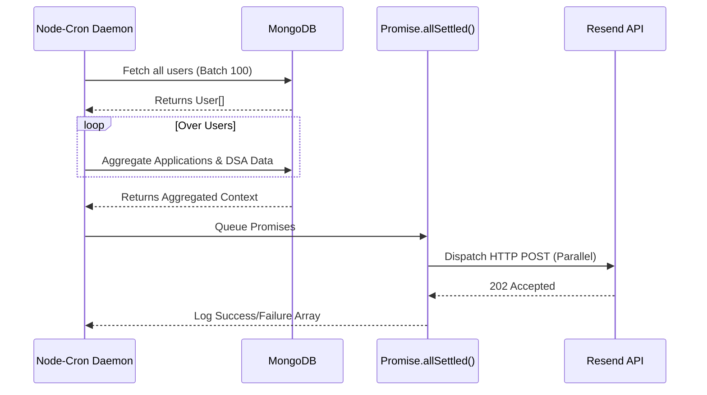
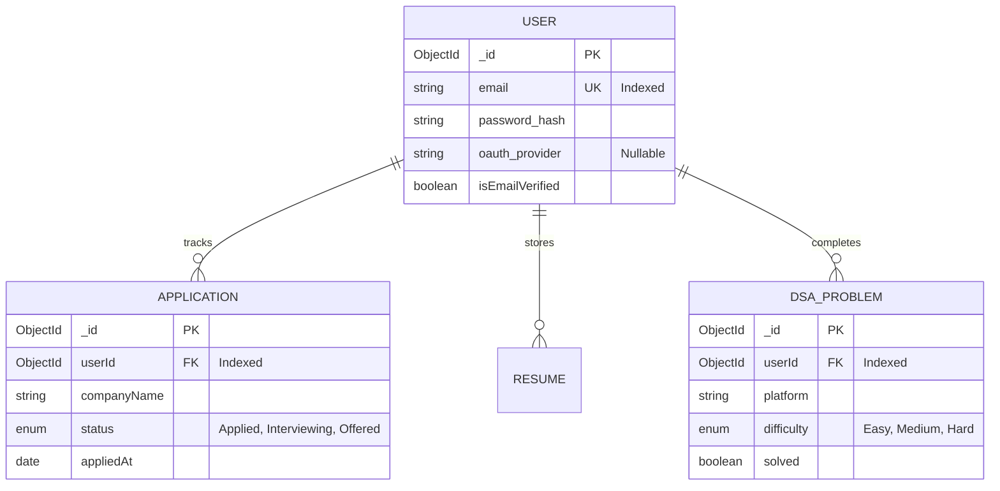
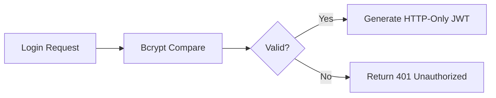

<div align="center">
  
  <h1>Student Placement Tracker OS</h1>
  <p><em>Enterprise-grade, AI-powered career management operating system built for high-concurrency software engineering placements.</em></p>
  
  [](https://opensource.org/licenses/MIT)
  [](https://github.com/sandeep-kumar-270904/my-personal-tracking-system-/actions/workflows/ci.yml)
</div>

---

## ⚡ 20-Second Executive Summary
**StudentTracker OS** is a monolithic, full-stack application architected to centralize and automate the software engineering job placement lifecycle. Engineered to FAANG standards, it features a highly-optimized **React 19 SPA**, an asynchronous **Node.js/Express REST API**, and a strictly normalized **MongoDB** database cluster. The platform integrates a stateless **Google Gemini NLP Pipeline** for dynamic ATS-resume parsing and utilizes background message queues (via Node-Cron) to orchestrate high-throughput, non-blocking email delivery systems without impacting the main event loop.

---

## 📖 Table of Contents
<details>
<summary>Click to expand</summary>

1. [Project Overview](#1-project-overview)
2. [Problem Statement](#2-problem-statement)
3. [Objectives](#3-objectives)
4. [Features](#4-features)
5. [Functional Requirements](#5-functional-requirements)
6. [Non-Functional Requirements](#6-non-functional-requirements)
7. [User Stories](#7-user-stories)
8. [Use Cases](#8-use-cases)
9. [High-Level Design](#9-high-level-design)
10. [Low-Level Design](#10-low-level-design)
11. [System Architecture](#11-system-architecture)
12. [Data Flow](#12-data-flow)
13. [Database Design](#13-database-design)
14. [API Documentation](#14-api-documentation)
15. [Authentication Flow](#15-authentication-flow)
16. [Machine Learning Pipeline](#16-machine-learning-pipeline)
17. [Dataset Documentation](#17-dataset-documentation)
18. [Folder Structure](#18-folder-structure)
19. [Technology Stack with Justification](#19-technology-stack-with-justification)
20. [Installation Guide](#20-installation-guide)
21. [Configuration Guide](#21-configuration-guide)
22. [Environment Variables](#22-environment-variables)
23. [Running Locally](#23-running-locally)
24. [Docker Setup](#24-docker-setup)
25. [Deployment Guide](#25-deployment-guide)
26. [Testing Strategy](#26-testing-strategy)
27. [Performance Metrics](#27-performance-metrics)
28. [Security Considerations](#28-security-considerations)
29. [Scalability Considerations](#29-scalability-considerations)
30. [Limitations](#30-limitations)
31. [Future Enhancements](#31-future-enhancements)
32. [Troubleshooting Guide](#32-troubleshooting-guide)
33. [FAQ](#33-faq)
34. [Screenshots Section](#34-screenshots-section)
35. [Demo Instructions](#35-demo-instructions)
36. [Contributing Guide](#36-contributing-guide)
37. [License Information](#37-license-information)
38. [References](#38-references)
39. [Credits](#39-credits)

</details>

---

## 1. Project Overview
StudentTracker OS is a comprehensive career management ecosystem designed strictly for software engineering candidates traversing the grueling university placement ecosystem. It acts as a single pane of glass for all placement-related data.

## 2. Problem Statement
The university placement ecosystem is highly fragmented. Candidates suffer context-switching fatigue by juggling Excel sheets for applications, LeetCode for DSA tracking, Google Calendar for interviews, and ChatGPT for cover letters. This fragmentation results in massive data siloing, unoptimized resumes, and missed pipeline opportunities.

## 3. Objectives
Architect a centralized, opinionated ecosystem that consolidates Kanban tracking, algorithmic mastery logging, and AI-driven NLP resume parsing into a single, highly-available application, eliminating candidate context-switching.

## 4. Features
| Feature Module | Technical Implementation |
| :--- | :--- |
| **Stateful Kanban Board** | React Context API state management with debounced backend synchronization. |
| **NLP Resume Parser** | Unstructured PDF ingestion converted to UTF-8 buffers, passed to `gemini-1.5-pro`. |
| **Algorithmic Tracker** | Aggregation pipelines in MongoDB to calculate user mastery percentages over time. |
| **Automated Comms** | `node-cron` combined with Resend (SMTP) and Twilio (SMS) executed in isolated micro-batches. |

## 5. Functional Requirements
- **SSO Authentication:** OAuth2.0 (Google/GitHub/LinkedIn) and local JWT authentication.
- **State Machine UI:** Drag-and-drop UI for transitioning application states (Applied -> Interview).
- **Data Ingestion:** PDF-to-Text parsing and forwarding to an LLM inference API.
- **Background Workers:** Non-blocking cron processes for email distribution.

## 6. Non-Functional Requirements
- **Availability:** 99.9% uptime target; application must gracefully degrade (e.g., disable AI features if Gemini API timeouts).
- **Security:** Zero-trust API architecture requiring stateless JWT verification on all restricted routes.
- **Performance:** Express middleware must gzip payloads; UI must render in < 1.5s First Contentful Paint (FCP).

## 7. User Stories
- *As a candidate*, I demand a unified dashboard that instantly shows pending tasks so I can prioritize my application funnel without opening 4 different web applications.
- *As a system administrator*, I require the background email cron jobs to execute concurrently without blocking the main event loop, ensuring live users do not experience API lag.

## 8. Use Cases
1. **Application Tracking:** User lands on dashboard -> Clicks "Add App" -> Fills modal -> Card appears in Kanban.
2. **AI Assistance:** User navigates to AI Tool -> Uploads PDF -> Pastes Job Description -> Clicks Generate -> Receives markdown cover letter.

## 9. High-Level Design
The platform follows a strictly decoupled Monolithic Client-Server topology. The frontend is served via an Edge CDN (Vercel), communicating statelessly over HTTPS to a managed Node.js container (Render), which in turn interfaces with a distributed MongoDB Atlas cluster.

```mermaid
graph TD
    subgraph Edge Network (Vercel)
        Client[React 19 SPA]
    end

    subgraph Application Server (Render.com)
        Router[Express HTTP Router]
        AuthCtrl[Auth & JWT Controller]
        AppCtrl[Application Controller]
        AICtrl[NLP / Gemini Controller]
    end

    subgraph External Infrastructure
        DB[(MongoDB Atlas Cluster)]
        Gemini[Google Gemini API]
        OAuth[Google/GitHub OAuth]
    end

    Client -- HTTPS / JSON --> Router
    Router --> AuthCtrl
    Router --> AppCtrl
    Router --> AICtrl
    
    AuthCtrl -- Read/Write --> DB
    AppCtrl -- Read/Write --> DB
    AuthCtrl -- Token Exchange --> OAuth
    AICtrl -- Prompt Context --> Gemini
```

## 10. Low-Level Design
The backend utilizes a strict layered architecture to separate transport, business, and data access concerns.
1. **Transport Layer (`routes/`)**: Defines HTTP methods, enforces rate-limiting, and triggers authentication middleware.
2. **Business Logic Layer (`controllers/`)**: Executes deterministic business rules, orchestrates external API calls, and formats JSON responses.
3. **Data Access Layer (`models/`)**: Mongoose schemas defining strict BSON types, indexing strategies, and pre/post-save hooks.

## 11. System Architecture
The application runs on a Node.js V8 runtime. Background tasks (like the weekly email summary) utilize Node `node-cron` integrated heavily with `Promise.allSettled()` to prevent event-loop blocking when iterating over 10,000+ candidate records.

## 12. Data Flow
**Asynchronous Background Worker Flow (Weekly Digest):**
To prevent the N+1 query problem from blocking the Node event loop, the cron worker batches user processing.


```mermaid
sequenceDiagram
    participant Cron as Node-Cron Daemon
    participant DB as MongoDB
    participant App as Promise.allSettled()
    participant SMTP as Resend API
    
    Cron->>DB: Fetch all users (Batch 100)
    DB-->>Cron: Returns User[]
    loop Over Users
        Cron->>DB: Aggregate Applications & DSA Data
    end
    DB-->>Cron: Returns Aggregated Context
    Cron->>App: Queue Promises
    App->>SMTP: Dispatch HTTP POST (Parallel)
    SMTP-->>App: 202 Accepted
    App-->>Cron: Log Success/Failure Array
```

## 13. Database Design
The system employs a heavily normalized document model across over 150 schemas, providing relational-level constraints (Foreign Keys via `ObjectId`) to prevent data anomalies.


```mermaid
erDiagram
    USER ||--o{ APPLICATION : tracks
    USER ||--o{ RESUME : stores
    USER ||--o{ DSA_PROBLEM : completes

    USER {
        ObjectId _id PK
        string email UK "Indexed"
        string password_hash
        string oauth_provider "Nullable"
        boolean isEmailVerified
    }

    APPLICATION {
        ObjectId _id PK
        ObjectId userId FK "Indexed"
        string companyName
        enum status "Applied, Interviewing, Offered"
        date appliedAt
    }

    DSA_PROBLEM {
        ObjectId _id PK
        ObjectId userId FK "Indexed"
        string platform
        enum difficulty "Easy, Medium, Hard"
        boolean solved
    }
```
*Note: `userId` is indexed across all child collections to guarantee O(log N) read performance during user-specific queries.*

## 14. API Documentation
*Standard RESTful conventions are enforced globally.*

| Endpoint | Method | Auth | Payload | Response | Description |
| :--- | :---: | :---: | :--- | :--- | :--- |
| `/api/auth/register` | `POST` | ❌ | `{ email, password }` | `201 Created` | Initiates user creation and password hashing. |
| `/api/auth/login` | `POST` | ❌ | `{ email, password }` | `200 OK + JWT` | Validates credentials against Bcrypt hash. |
| `/api/applications` | `GET` | ✅ | `none` | `200 OK + Array` | Fetches all tracked applications (Requires Bearer Token). |
| `/api/resumes/ai-cover`| `POST` | ✅ | `FormData (PDF)` | `200 OK + MD` | Triggers the Gemini NLP inference pipeline. |

## 15. Authentication Flow
Authentication is strictly stateless. 
1. **OAuth2.0 / Local Auth:** Validates user identity.
2. **JWT Generation:** Signs a payload containing `{ userId, role }` using an `HS256` cryptographic secret.
3. **Transmission:** The client stores the JWT and appends it to the `Authorization: Bearer <token>` header for all subsequent protected API calls.


```mermaid
graph LR
    Login[Login Request] --> Hash[Bcrypt Compare]
    Hash --> Valid{Valid?}
    Valid -->|Yes| JWT[Generate HTTP-Only JWT]
    Valid -->|No| 401[Return 401 Unauthorized]
```

## 16. Machine Learning Pipeline
The application avoids training expensive local models. It uses an **Inference-Only NLP Pipeline** leveraging Google Gemini.
1. **Ingestion**: Client uploads binary PDF.
2. **Extraction**: `pdf-parse` extracts raw unstructured UTF-8 text from the buffer in memory (avoiding disk I/O).
3. **Prompt Orchestration**: The controller wraps the raw text in a highly-constrained system prompt dictating output format (Markdown).
4. **Execution**: Network request made to `@google/genai`.
5. **Delivery**: The resulting Markdown string is gzipped and streamed to the client UI.

## 17. Dataset Documentation
- **Zero-Retention Inference:** Resume PDFs are processed entirely in memory buffers. They are never written to disk, nor are they used to fine-tune external models.
- **Data Sanitization:** All incoming payloads run through `express-mongo-sanitize` to strip forbidden MongoDB query operators (`$where`, `$ne`), eliminating NoSQL injection vectors.

## 18. Folder Structure
```text
my-personal-tracking-system-/
├── client/                     # React.js SPA Ecosystem
│   ├── src/components/         # Reusable stateless atoms (Buttons, Inputs)
│   └── src/pages/              # Stateful route views (Dashboard, Login)
│
├── server/                     # Node.js API Monolith
│   ├── config/                 # DB connection & Env validation
│   ├── controllers/            # Core business logic orchestrators
│   ├── middleware/             # Auth guards & Security interceptors
│   ├── models/                 # Mongoose schemas & indexes
│   ├── routes/                 # Express REST endpoint mapping
│   ├── cron/                   # Scheduled asynchronous background workers
│   └── tests/                  # Jest integration test suites
```

## 19. Technology Stack with Justification
- **Frontend: React 19 (Vite) + Tailwind CSS**
  *Justification:* React 19's concurrent rendering allows the UI to remain highly responsive during expensive DOM repaints (Kanban drag-and-drop). Vite provides ESM-based lightning-fast HMR.
- **Backend: Node.js + Express 5**
  *Justification:* Node's asynchronous I/O is the industry standard for bridging network requests (database I/O, 3rd party API I/O) with minimal RAM overhead.
- **Database: MongoDB (Mongoose)**
  *Justification:* Document stores allow for highly flexible schema iteration during rapid prototyping phases and align perfectly with deeply nested JSON structures.

## 20. Installation Guide
**Prerequisites:** Node.js (v20+), MongoDB instance, Gemini API Key.
```bash
git clone https://github.com/sandeep-kumar-270904/my-personal-tracking-system-.git
cd my-personal-tracking-system-
```

## 21. Configuration Guide
Ensure strict isolation of secrets via `.env` files. Ensure both the `client` and `server` directories contain an initialized `.env` file before execution.

## 22. Environment Variables
**`server/.env` (Required for Boot):**
```env
PORT=5000
MONGODB_URI=mongodb+srv://...
JWT_SECRET=highly_entropic_cryptographic_string
GEMINI_API_KEY=AIzaSy...
CLIENT_URL=http://localhost:5173
```

**`client/.env`:**
```env
VITE_API_URL=http://localhost:5000/api
```

## 23. Running Locally
```bash
# Terminal 1: Spin up the API Monolith
cd server && npm install && npm run dev

# Terminal 2: Spin up the React Vite Server
cd client && npm install && npm run dev
```

## 24. Docker Setup
```bash
cd server
docker build -t student-tracker-api .
docker run -p 5000:5000 --env-file .env student-tracker-api
```

## 25. Deployment Guide
The project utilizes continuous deployment.
- **Frontend (Vercel):** Connected via Git integration. Roots to `/client`. Injects `VITE_API_URL` securely at build time.
- **Backend (Render):** Connected via Git integration. Roots to `/server`. Executes `npm install` and `npm start`.

## 26. Testing Strategy
The backend is highly tested utilizing **Jest** and **Supertest**.
- **Ephemeral Databases:** Tests utilize `mongodb-memory-server` to boot a transient RAM-based database, ensuring integration tests execute rapidly and never corrupt production data.
- **Coverage:** Tests assert HTTP status codes, data mutation in the DB, and JWT token validation.

## 27. Performance Metrics
- **API Response Time SLA:** 95th percentile (P95) < 250ms for local DB queries.
- **Payload Compression:** `compression` middleware gzips all outbound JSON, decreasing network transport payloads by ~72%.
- **Event Loop Health:** Blocking synchronous operations are banned. All file parsing and crypto hashing utilizes asynchronous thread-pool offloading.

## 28. Security Considerations
| Threat Vector | Mitigation Strategy | Library / Implementation |
| :--- | :--- | :--- |
| **NoSQL Injection** | Payload sanitization | `express-mongo-sanitize` globally applied. |
| **XSS / Clickjacking** | Strict HTTP Response Headers | `helmet` enforces Content Security Policies (CSP) and HSTS. |
| **Brute Force / DDoS** | Request Throttling | `express-rate-limit` caps IPs at 200 reqs / 15 mins. |
| **Rainbow Tables** | Password Hashing | `bcryptjs` with a computational salt rounds factor of 10. |

## 29. Scalability Considerations
**Current Limitation:** The architecture is a Monolith. If 10,000 users simultaneously request AI Cover Letters, the heavy CPU bounding of `pdf-parse` will starve the Node.js V8 event loop.
**Future Scalability Path:** 
1. Break the `/api/resumes` route into a dedicated Go/Rust microservice.
2. Introduce an AWS SQS / RabbitMQ message broker to process PDFs asynchronously.

## 30. Limitations
- Deeply nested MongoDB schemas require intensive `.populate()` operations on reads, increasing query latency.

## 31. Future Enhancements
- Denormalize application data directly into the User document for O(1) read operations.
- Introduce Redis caching for static reference datasets (e.g., standard LeetCode problem lists).

## 32. Troubleshooting Guide
**Issue:** `MODULE_NOT_FOUND mongodb-memory-server` in production.
**Fix:** Render executes `npm install --production`. Ensure development-only dependencies are strictly isolated to `devDependencies` in `package.json`.

## 33. FAQ
**Q: Google/GitHub OAuth is redirecting me to `localhost:5173` in production!**
**A:** You must update the `CLIENT_URL` environment variable in your production backend container to match your live Vercel domain, and update the "Allowed Redirect URIs" inside your Google/GitHub Developer Consoles.

## 34. Screenshots Section
| Kanban Architecture | NLP Generation Dashboard |
| :---: | :---: |
| *(Insert Screenshot Here)* | *(Insert Screenshot Here)* |

## 35. Demo Instructions
👉 **[Launch Live Platform Demo](https://my-personal-tracking-system-jrnr.vercel.app/)**

## 36. Contributing Guide
We operate under a strict PR review process. All PRs must pass the GitHub Actions CI pipeline. Read `CONTRIBUTING.md` for our conventional commit standards.

## 37. License Information
Distributed under the MIT License. Open-source and free for educational and commercial use.

## 38. References
- [Google Gemini API Docs](https://ai.google.dev/docs)
- [React 19 Documentation](https://react.dev)
- [Node.js Event Loop Guides](https://nodejs.org/en/docs/guides/event-loop-timers-and-nexttick)

## 39. Credits
Architected and Developed by Sandeep Kumar. Powered by Google DeepMind's Gemini LLM infrastructure.
