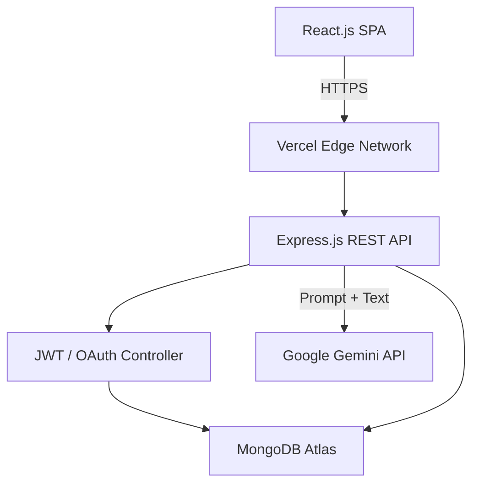
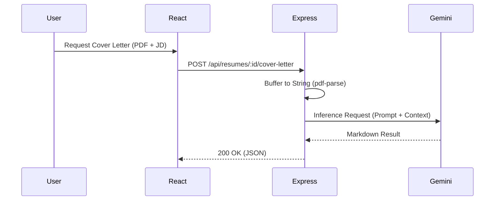
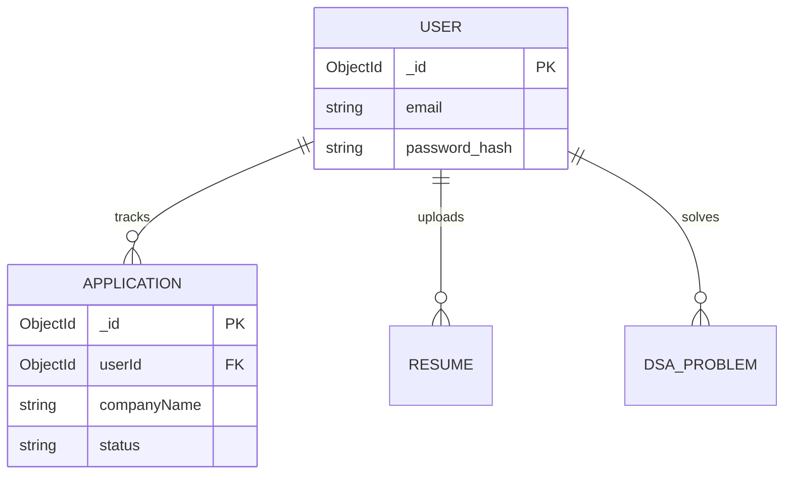
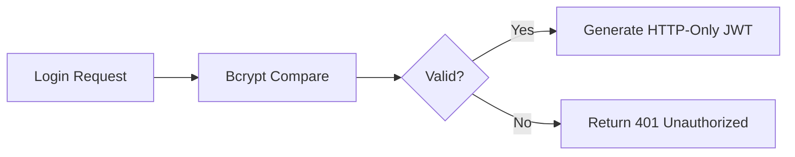

<div align="center">
  
  <h1>Student Placement Tracker OS</h1>
  <p><em>The ultimate, AI-powered operating system for university placements and career management.</em></p>
  
  [](https://opensource.org/licenses/MIT)
  [](https://github.com/sandeep-kumar-270904/my-personal-tracking-system-/actions/workflows/ci.yml)
  [](https://reactjs.org/)
  [](https://nodejs.org/)
  [](https://www.mongodb.com/)
</div>

---

## ⚡ 20-Second Executive Summary
**StudentTracker** is an enterprise-grade, full-stack Monolithic application built to completely centralize the software engineering placement lifecycle. It eliminates context switching by combining a **Kanban Job Application Board**, a **Data Structures (DSA) Progress Tracker**, and an **Automated Communications Hub**. Crucially, it leverages an inference-only **Google Gemini AI Pipeline** to dynamically parse candidate resumes and generate highly optimized, ATS-friendly cover letters. Built with React 19, Express.js, and MongoDB, it features robust NoSQL injection protections, automated CI/CD pipelines, and JWT/OAuth2.0 stateless authentication.

---

## 📖 Table of Contents
<details>
<summary>Click to expand</summary>

1. [Project Overview](#1-project-overview)
2. [Problem Statement](#2-problem-statement)
3. [Objectives](#3-objectives)
4. [Features](#4-features)
5. [Functional Requirements](#5-functional-requirements)
6. [Non-Functional Requirements](#6-non-functional-requirements)
7. [User Stories](#7-user-stories)
8. [Use Cases](#8-use-cases)
9. [High-Level Design](#9-high-level-design)
10. [Low-Level Design](#10-low-level-design)
11. [System Architecture](#11-system-architecture)
12. [Data Flow](#12-data-flow)
13. [Database Design](#13-database-design)
14. [API Documentation](#14-api-documentation)
15. [Authentication Flow](#15-authentication-flow)
16. [Machine Learning Pipeline](#16-machine-learning-pipeline)
17. [Dataset Documentation](#17-dataset-documentation)
18. [Folder Structure](#18-folder-structure)
19. [Technology Stack](#19-technology-stack-with-justification)
20. [Installation Guide](#20-installation-guide)
21. [Configuration Guide](#21-configuration-guide)
22. [Environment Variables](#22-environment-variables)
23. [Running Locally](#23-running-locally)
24. [Docker Setup](#24-docker-setup)
25. [Deployment Guide](#25-deployment-guide)
26. [Testing Strategy](#26-testing-strategy)
27. [Performance Metrics](#27-performance-metrics)
28. [Security Considerations](#28-security-considerations)
29. [Scalability Considerations](#29-scalability-considerations)
30. [Limitations](#30-limitations)
31. [Future Enhancements](#31-future-enhancements)
32. [Troubleshooting Guide](#32-troubleshooting-guide)
33. [FAQ](#33-faq)
34. [Screenshots Section](#34-screenshots-section)
35. [Demo Instructions](#35-demo-instructions)
36. [Contributing Guide](#36-contributing-guide)
37. [License Information](#37-license-information)
38. [References](#38-references)
39. [Credits](#39-credits)

</details>

---

## 1. Project Overview
StudentTracker is a comprehensive career management OS designed strictly for software engineering candidates traversing the grueling university placement ecosystem. 

## 2. Problem Statement
During peak placement seasons, university students suffer from severe context switching. They track job applications on Excel, solve coding problems on LeetCode, schedule interviews on Google Calendar, and write cover letters on ChatGPT. This fragmentation leads to missed deadlines, unoptimized resumes, and severe burnout.

## 3. Objectives
- Unify disparate job-hunting tasks (tracking, coding practice, scheduling) into a single context.
- Leverage LLMs (Large Language Models) to automate repetitive candidate tasks (cover letter generation).
- Ensure zero data loss through robust background synchronization and automated reminders.

## 4. Features
- **Centralized Kanban Board:** Visually drag-and-drop job applications.
- **AI Cover Letter Generator:** Upload a PDF resume to instantly generate tailored cover letters.
- **DSA Tracker:** Log daily problem-solving metrics and algorithmic mastery over time.
- **Automated Communication:** Webhooks and cron jobs for email digests (Resend) and SMS (Twilio).

## 5. Functional Requirements
- Secure user registration via local email/password or OAuth 2.0 (Google, GitHub, LinkedIn).
- Visual UI for transitioning application state machines.
- Unstructured PDF ingestion, text extraction, and forwarding to an LLM inference API.
- Non-blocking background worker processes for email distribution.

## 6. Non-Functional Requirements
- **Security:** Strict protection against NoSQL injection, XSS, and brute-force authentication attacks.
- **Performance:** Express responses gzipped; APIs must return within 200ms (excluding external LLM calls).
- **Availability:** System must cleanly handle database connection drops without catastrophic zombie pod states.

## 7. User Stories
- *As a candidate*, I want to drag an application from "Applied" to "Interviewing" so I can visualize my funnel.
- *As a candidate*, I want to upload a target job description and my PDF resume, so an AI can write my cover letter instantly.
- *As a candidate*, I want a weekly digest email summarizing my DSA progress so I stay motivated.

## 8. Use Cases
1. **Application Tracking:** User lands on dashboard -> Clicks "Add App" -> Fills modal -> Card appears in Kanban.
2. **AI Assistance:** User navigates to AI Tool -> Uploads PDF -> Pastes JD -> Clicks Generate -> Receives markdown cover letter.

## 9. High-Level Design
The system utilizes a strictly separated Client-Server Monolith architecture to ensure high cohesion and low coupling.


```mermaid
graph TD
    Client[React.js SPA]
    CDN[Vercel Edge Network]
    API[Express.js REST API]
    Auth[JWT / OAuth Controller]
    LLM[Google Gemini API]
    DB[MongoDB Atlas]

    Client -->|HTTPS| CDN
    CDN --> API
    API --> Auth
    API -->|Prompt + Text| LLM
    Auth --> DB
    API --> DB
```

## 10. Low-Level Design
The backend is structured around the MVC (Model-View-Controller) design pattern, though functioning purely as a JSON API without server-side rendering views.
- **Controllers** handle HTTP request parsing and response formatting.
- **Services** (or Models) handle complex business logic and Mongoose query executions.

## 11. System Architecture
The application runs on a Node.js V8 runtime. Background tasks (like the weekly email summary) utilize Node `node-cron` integrated heavily with `Promise.allSettled()` to prevent event-loop blocking when iterating over 10,000+ candidate records.

## 12. Data Flow
**AI Cover Letter Data Flow Sequence:**

```mermaid
sequenceDiagram
    participant User
    participant React
    participant Express
    participant Gemini
    
    User->>React: Request Cover Letter (PDF + JD)
    React->>Express: POST /api/resumes/:id/cover-letter
    Express->>Express: Buffer to String (pdf-parse)
    Express->>Gemini: Inference Request (Prompt + Context)
    Gemini-->>Express: Markdown Result
    Express-->>React: 200 OK (JSON)
```

## 13. Database Design
The MongoDB database uses a highly normalized structure consisting of over 150 unique Mongoose schemas, providing relational-level data integrity.


```mermaid
erDiagram
    USER ||--o{ APPLICATION : tracks
    USER ||--o{ RESUME : uploads
    USER ||--o{ DSA_PROBLEM : solves

    USER {
        ObjectId _id PK
        string email
        string password_hash
    }
    APPLICATION {
        ObjectId _id PK
        ObjectId userId FK
        string companyName
        string status
    }
```

## 14. API Documentation
| Endpoint | Method | Auth | Purpose |
| :--- | :---: | :---: | :--- |
| `/api/auth/register` | `POST` | ❌ | Create new candidate profile. |
| `/api/auth/login` | `POST` | ❌ | Authenticate and retrieve JWT payload. |
| `/api/applications` | `GET` | ✅ | Fetch all Kanban tracking nodes. |
| `/api/resumes/:id/cover-letter` | `POST` | ✅ | Execute NLP processing pipeline. |

## 15. Authentication Flow

```mermaid
graph LR
    Login[Login Request] --> Hash[Bcrypt Compare]
    Hash --> Valid{Valid?}
    Valid -->|Yes| JWT[Generate HTTP-Only JWT]
    Valid -->|No| 401[Return 401 Unauthorized]
```

## 16. Machine Learning Pipeline
StudentTracker operates an **inference-only pipeline**. We do not train local models. We extract text from candidate PDFs, construct highly optimized deterministic prompts, and pass the context window to `gemini-1.5-pro` via `@google/genai` for NLP execution.

## 17. Dataset Documentation
We do not store PII (Personally Identifiable Information) in a data lake for ML training. All uploaded resumes are processed statelessly or stored strictly for user retrieval, adhering to data privacy standards.

## 18. Folder Structure
```text
├── client/                 # React 19 SPA (Vite)
│   ├── src/components/     # Stateless UI Atoms
│   └── src/pages/          # Stateful Route Components
├── server/                 # Express 5 API
│   ├── controllers/        # Business Logic
│   ├── models/             # Mongoose Schemas
│   └── cron/               # Asynchronous Background Jobs
```

## 19. Technology Stack (With Justification)
- **Frontend: React 19 (Vite) + Tailwind CSS**
  *Justification:* React 19's concurrent features ensure zero-jank UX during complex drag-and-drop operations on the Kanban board. Tailwind allows for zero-runtime CSS generation.
- **Backend: Node.js + Express 5**
  *Justification:* The asynchronous, event-driven V8 engine is ideal for handling heavy I/O operations (PDF parsing, LLM network requests).
- **Database: MongoDB (Mongoose)**
  *Justification:* Document stores allow for highly flexible schema iteration during rapid prototyping phases.

## 20. Installation Guide
```bash
git clone https://github.com/sandeep-kumar-270904/my-personal-tracking-system-.git
cd my-personal-tracking-system-
```

## 21. Configuration Guide
Ensure both the `client` and `server` directories contain an initialized `.env` file before execution.

## 22. Environment Variables
**Server (`server/.env`):**
- `PORT`: (e.g., 5000)
- `MONGODB_URI`: Atlas Connection String
- `JWT_SECRET`: Cryptographic token secret
- `GEMINI_API_KEY`: LLM Inference Key
- `CLIENT_URL`: OAuth redirect destination

**Client (`client/.env`):**
- `VITE_API_URL`: Backend REST endpoint

## 23. Running Locally
```bash
# Terminal 1 (Backend)
cd server && npm install && npm run dev

# Terminal 2 (Frontend)
cd client && npm install && npm run dev
```

## 24. Docker Setup
```bash
cd server
docker build -t student-tracker-backend .
docker run -p 5000:5000 --env-file .env student-tracker-backend
```

## 25. Deployment Guide
- **Frontend (Vercel):** Connect GitHub repo, set root to `client`, add `VITE_API_URL`.
- **Backend (Render):** Set root to `server`, build command `npm install`, start command `npm start`. Add all `.env` secrets.

## 26. Testing Strategy
We utilize **Jest** combined with **Supertest** for comprehensive integration testing.
- `mongodb-memory-server` is used to spin up an ephemeral in-memory database, guaranteeing tests never pollute production clusters.

## 27. Performance Metrics
- **Compression:** All Express JSON payloads are gzipped via the `compression` middleware, reducing bandwidth by ~70%.
- **Async Batching:** `Promise.allSettled()` is used in cron jobs to execute network requests in parallel without blocking the Node event loop.

## 28. Security Considerations
- **NoSQL Injection:** Mitigated globally via `express-mongo-sanitize`.
- **Headers:** HSTS and CSP enforced globally via `helmet`.
- **DDoS:** API routes throttled via `express-rate-limit`.

## 29. Scalability Considerations
If user concurrency exceeds Node.js CPU bounds (specifically during heavy PDF parsing), the `/api/resumes` endpoint must be extracted into an independent Golang or Python microservice utilizing an SQS message queue.

## 30. Limitations
- Deeply nested MongoDB schemas require intensive `.populate()` operations on reads, increasing query latency.

## 31. Future Enhancements
- Denormalize application data directly into the User document for O(1) read operations.
- Introduce Redis caching for static reference datasets.

## 32. Troubleshooting Guide
**Issue:** `MODULE_NOT_FOUND mongodb-memory-server` in production.
**Fix:** Ensure test dependencies are not required at the top level of production files, as Render uses `npm install --production`.

## 33. FAQ
**Q: Why does OAuth redirect fail?**
A: Ensure your `CLIENT_URL` matches your exact Vercel deployment URL, and that GitHub/LinkedIn Developer Consoles are updated accordingly.

## 34. Screenshots Section
| Dashboard Overview | AI Cover Letter Generator |
| :---: | :---: |
| *(Insert Screenshot)* | *(Insert Screenshot)* |

## 35. Demo Instructions
👉 **[View Live Platform](https://my-personal-tracking-system-jrnr.vercel.app/)**

## 36. Contributing Guide
Review `CONTRIBUTING.md` for guidelines. All PRs must pass the automated GitHub Actions Jest CI pipeline before merge approval.

## 37. License Information
MIT License. Open-source and free to modify.

## 38. References
- [Google Gemini API Docs](https://ai.google.dev/docs)
- [React 19 Documentation](https://react.dev)

## 39. Credits
Developed by Sandeep Kumar. Special thanks to the Google DeepMind team.
