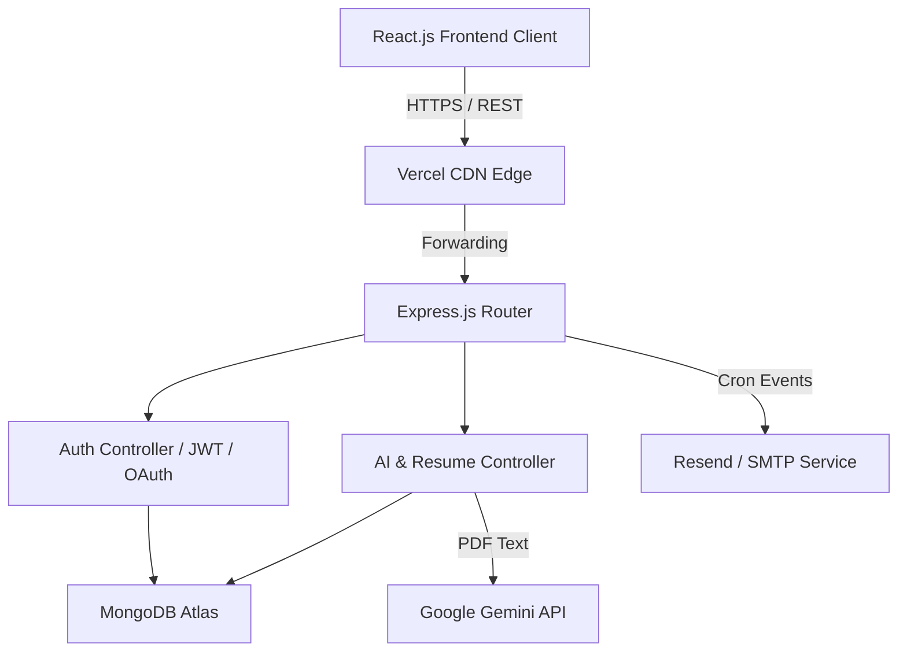
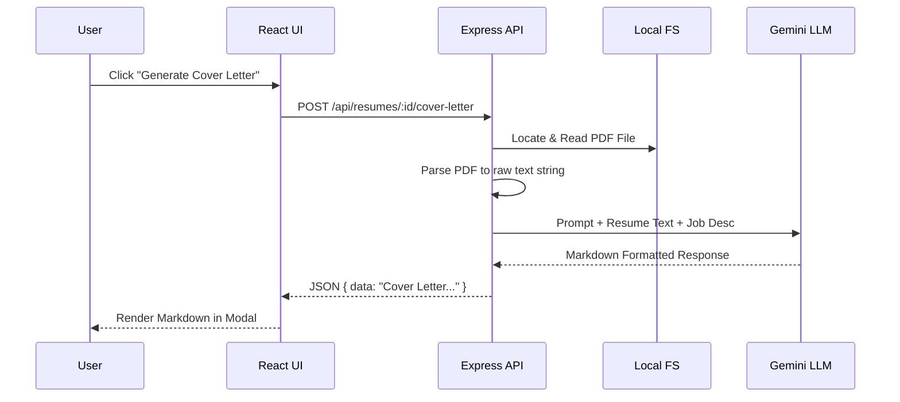
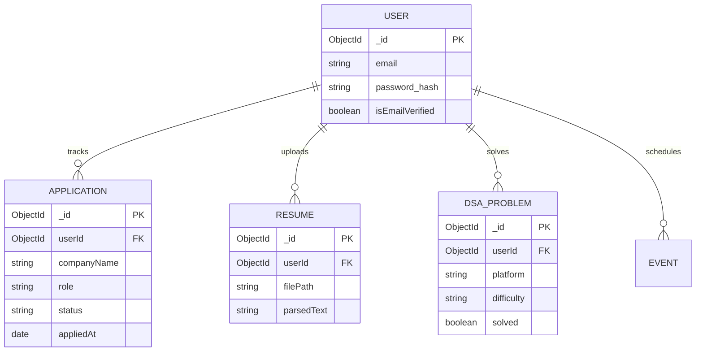
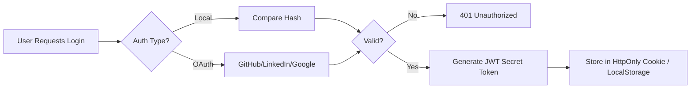

# System Architecture & Design Document

This document serves as the technical blueprint for the StudentTracker OS. It is intended for System Architects, Senior Engineers, and open-source contributors who need to understand the structural decisions, data flows, and architectural boundaries of the system.

---

## 1. Objectives & Requirements

### 1.1 Core Objectives
- Unify disparate job-hunting tasks (tracking, coding practice, scheduling) into a single context.
- Leverage LLMs (Large Language Models) to automate repetitive candidate tasks (cover letter generation).
- Ensure zero data loss through robust background synchronization and automated email/SMS reminders.

### 1.2 Functional Requirements
- **Authentication:** Users must be able to securely register via email/password or OAuth 2.0 (Google, GitHub, LinkedIn).
- **Kanban Board:** Users can visually transition job applications between statuses.
- **AI Processing:** The system must accept PDF resumes, extract raw text, and stream it to the Gemini LLM for analysis.
- **Background Jobs:** The system must run weekly cron jobs to email users a summary of their applications and DSA progress.

### 1.3 Non-Functional Requirements
- **Security:** API endpoints must be protected against NoSQL injection, XSS, and brute-force attacks.
- **Performance:** Background tasks (like email dispatch) must not block the main Node.js event loop.
- **Availability:** The system must cleanly recover from database connection drops.

---

## 2. High-Level Design (HLD)

The application follows a classic Monolithic Client-Server architecture, divided strictly between a Single Page Application (React) and a RESTful API (Express).

---

## 3. Low-Level Design (LLD) & Data Flow

### 3.1 AI Cover Letter Generation Data Flow
When a user requests an AI-generated cover letter, the system orchestrates a complex flow between the local filesystem, the database, and an external LLM.

---

## 4. Database Design

The system uses MongoDB. Interestingly, the architecture deliberately avoids heavy embedding in favor of a highly normalized schema structure (spanning over 150 distinct schemas). This strictly enforces data typing and referential integrity, resembling a relational PostgreSQL database structure within a NoSQL environment.

### 4.1 Core Entity-Relationship (ER) Diagram

---

## 5. Authentication Flow

Security is handled via stateless JSON Web Tokens (JWT). The system also supports extensive OAuth integration.

---

## 6. Machine Learning Pipeline (Gemini AI)

Unlike traditional ML applications that require training custom models on AWS SageMaker, StudentTracker utilizes a purely inference-based pipeline via Google's Gemini LLM.

**Pipeline Steps:**
1. **Ingestion:** Candidate uploads a `.pdf`.
2. **Extraction:** `pdf-parse` converts the binary buffer into a raw UTF-8 text string.
3. **Prompt Engineering:** The Express backend wraps the text in a highly-structured prompt instructing the LLM to act as a "Senior FAANG Recruiter".
4. **Inference:** The prompt is sent to `gemini-1.5-pro` via the `@google/genai` SDK.
5. **Formatting:** The response is strictly requested in Markdown format for seamless rendering on the React frontend.

*Dataset Note: We do not store or fine-tune models on user resumes. All AI interactions are stateless inference calls.*
